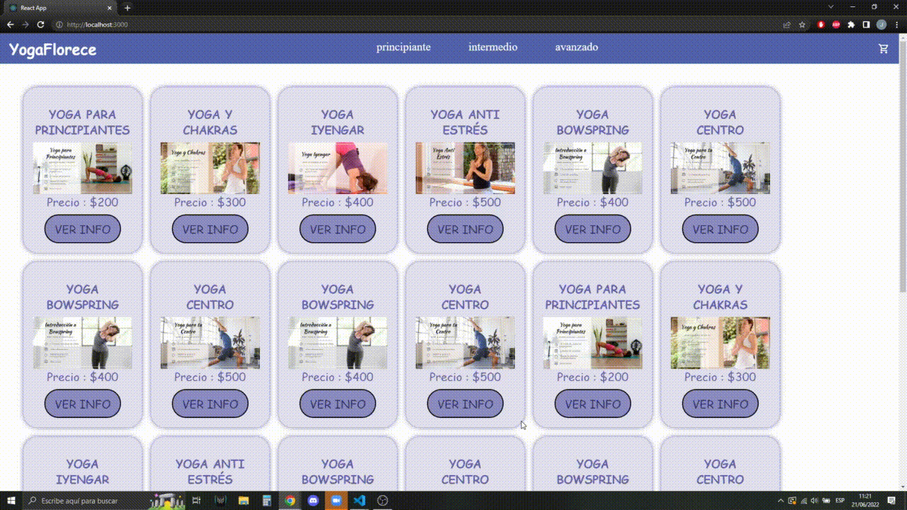

Jorge Niro Proyecto YogaFlorece (React JS)

Dependencias: 

React 
React-hook-form
React-router-dom

Descripcion: 

YogaFlorece intenta ser un portal de yoga (valga la redundancia)

Navegación: 

Por el momento sólo se puede observar una lista imaginaria de cursos y acceder al detalle de los mismos dando click en "ver info"

